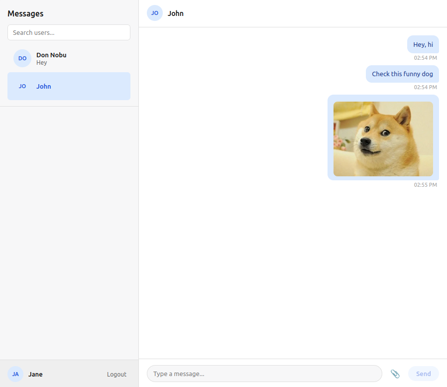
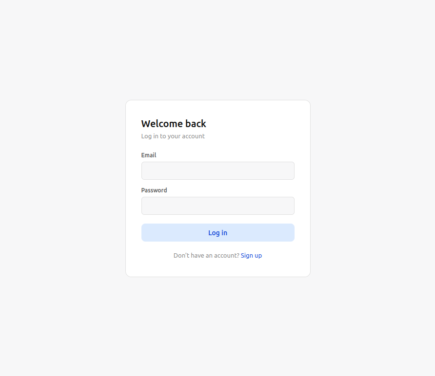

# Messaging Client

Frontend client for a messaging platform built with React.

This application consumes a Ruby on Rails backend API and provides a modern interface for authentication, conversations and real-time style messaging interactions.

## Features

- User authentication
- Messaging interface
- Conversation management
- API integration
- Dynamic React components
- Client-side routing
- Responsive interface
- Error handling and validation

## Tech Stack

- React
- JavaScript
- CSS
- React Router
- REST API

## Backend API

This frontend is designed to work together with the backend API:

- [messaging-api](YOUR_LINK_HERE)

## Live demo

- https://react-messaging-client.onrender.com

## Installation

Clone the repository:

```bash
git clone https://github.com/bachatron/messaging-client.git
cd messaging-client
```

Install dependencies:

```bash
npm install
```

Start the development server:

```bash
npm run dev
```

## Environment Variables

Create a `.env` file if required:

```env
VITE_API_URL=
```

## Project Structure

The project is organized using reusable React components and separated application logic for:

- Authentication
- API communication
- State management
- Routing
- Messaging functionality

## Future Improvements

- Real-time WebSocket communication
- Push notifications
- Dark mode
- Better mobile responsiveness
- Dockerized deployment

## Screnshots

## Chat

<p align="center">
  
</p>

## Login

<p align="center">
  
</p>

## Author

bachatron
